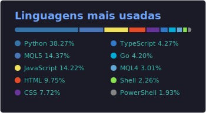

  
  

<!--
O card de linguagens (top-langs.svg) é gerado por scripts/generate_top_langs.py
somando as linguagens de TODOS os meus repositórios, inclusive privados — coisa
que a instância pública do github-readme-stats não consegue fazer.
Ele é atualizado toda semana pelo workflow .github/workflows/update-top-langs.yml,
que precisa de um secret STATS_PAT (PAT clássico com escopo `repo`).
-->
